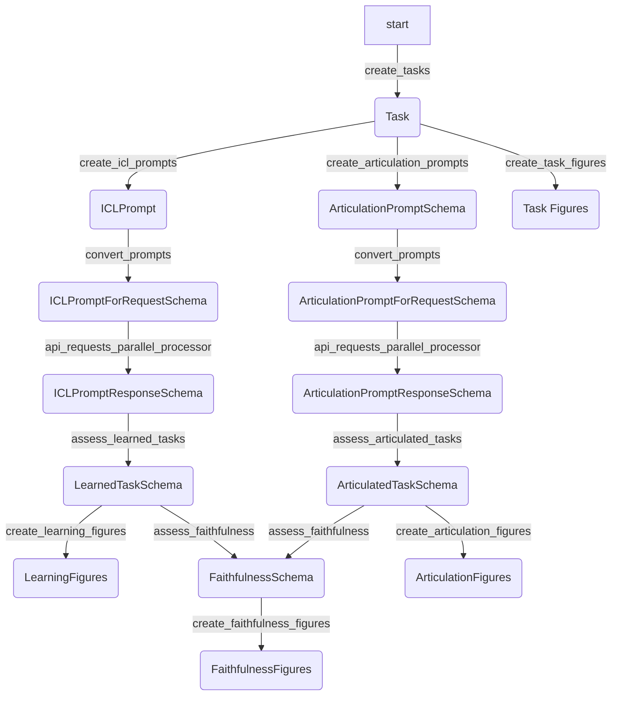

```
TaskSchema: {
    n: Number of features
    r: Number of rules
    val_pct: Percentage of validation data
    notation_type: Type of notation used
}
```

```
ICLPromptSchema: {
    task: TaskSchema
    prompt_type: Type of prompt
    prompt: Prompt
}
```


README: LLM Classification Rule Articulation Investigation

This README documents a series of Python scripts developed for investigating the capability of Large Language Models (LLMs) to articulate and apply classification rules in natural language processing tasks. The goal is to understand how well LLMs can express rules used for classification tasks and to determine if LLMs can learn tasks accurately without articulating the underlying rule.
Overview of the Investigation
Goal

The primary objective is to explore whether there are classification tasks (denoted as T) that LLMs can learn with high accuracy but struggle to articulate the learned rule in natural language. This exploration aims to identify tasks where LLMs can perform well (>90% accuracy) but may not reliably articulate the rule they have applied.
Methodology

The investigation involves several stages, each with a specific Python script to automate and facilitate the process:

    Dataset Generation: Generating datasets based on specific classification rules.
    Model Interaction: Using the OpenAI API to interact with LLMs, including training, making predictions, and performing k-fold cross-validation.
    Articulation of Rules: Evaluating the LLM's ability to articulate the rules it has learned through classification tasks.

Scripts
1. Dataset Generation and Partitioning

dataset_partitioner.py

    Function: Generates datasets with binary strings and partitions them based on predefined rules.
    Objective: To create datasets that are used for training and testing LLMs in classification tasks.

2. Model Training and Prediction

model_training.py

    Function: Trains a model on a given dataset and evaluates its performance.
    Objective: To assess the model's learning and prediction capabilities on the datasets generated in Script 1.

3. Learning

learning.py

    Function: In-context learning results
    Objective: To validate the model's performance across different subsets of the data and ensure its generalization capability.

4. Prompt Generation for Model

prompt_generation.py

    Function: Generates prompts based on the datasets for querying LLMs.
    Objective: To create structured queries for LLMs that facilitate the investigation of their rule articulation and application abilities.

5. Interacting with OpenAI API

openai_interaction.py

    Function: Sends prompts to the OpenAI API and saves the responses.
    Objective: To interact with LLMs using the OpenAI API, sending them the prompts generated in Script 4 and saving their responses for analysis.

TODO

    Read Owain's Paper: Incorporate insights and methodologies from the paper to enhance the investigation.
    Increase Variety in Classification Tasks: Explore a broader range of tasks to test the LLMs' articulation capabilities more thoroughly.
    Improve Elicitation Methods: Enhance the methods for eliciting rule articulation from LLMs, including variations in prompts and context.
    Further Investigation on Faithfulness and Dishonesty: Explore more deeply into the concepts of faithfulness in LLM reasoning and the factors influencing 'dishonesty' in responses.
    Quantitative Analysis: Implement methods for a more detailed quantitative analysis of LLM performance and rule articulation.
    Report Preparation: Compile findings, including examples of prompts, classification tasks, and model articulations, into a comprehensive report with figures and tables.

Notes on Current Progress

    The scripts so far address the initial stages of dataset generation, model interaction, and basic prompt construction.
    Further refinement in prompt generation and analysis scripts is needed to align more closely with the investigation's objectives.
    The investigation is yet to incorporate the insights from Owain's paper and a broader range of classification tasks.

Conclusion

This README outlines the current progress in the project aimed at understanding the capability of LLMs in articulating and applying classification rules. The project is ongoing, with several areas identified for further development and investigation.

# Independent Variables

These are variables that you manipulate or set at the beginning of your experiment to observe their effect on the dependent variables.

    n (Number of Features): The length of binary strings used in dataset generation.
    r (Number of Rules): The number of rules applied for dataset partitioning.
    model_name (OpenAI Model Used): The specific OpenAI model used for querying (e.g., "text-davinci-003").
    k (Number of Folds in K-Fold Cross-Validation): Determines how many folds the dataset is split into for cross-validation.
    prompt_type: The nature or type of prompts used for querying the OpenAI model.
    notation_type: The type of notation used for data representation (e.g., 'set_notation', 'string_notation').

# Dependent Variables

These are the outcomes or responses measured in the experiment.

    api_response: The response received from the OpenAI API.
    classification_accuracy: The accuracy of classifications made by the model during k-fold cross-validation or other tests.
    prompt_effectiveness: The effectiveness of different prompts in eliciting accurate or desired responses from the model.

# Controlled Variables

These are variables that are kept constant throughout the experiment to ensure that the test conditions are as consistent as possible.

    max_tokens: The maximum number of tokens in the responses from the OpenAI model.